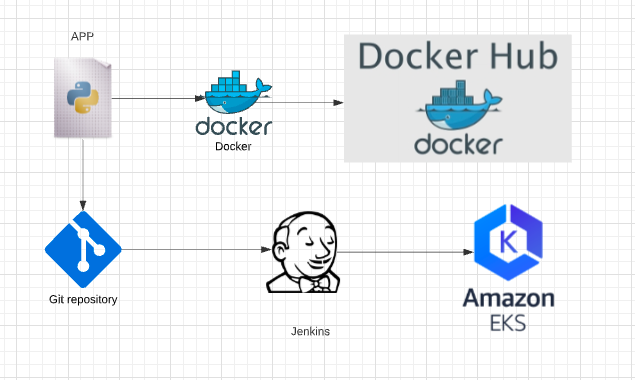

# Udacity Capstone Project
## International Space Station Locator
**************************************************************************************************************************
### Project Overview
In this project we will build a CI/CD pipeline with rolling deployment. A small app that shows the current loction of international space staion, which is dockerized and deployed into AWS EKS.

### Project Installations

* Google API - Subcribe for google maps(geocoding, directions, Javascipt) API key

* Environment Setup
    Create a virtual environment python3 -m venv ~/.venv
    Activate it source ~/.venv/bin/activate

#### Cluster creation

* Install Eksctl and create cluster
 ```
eksctl create cluster \
--name <my-cluster> \
--version <1.17> \
--region <us-west-2> \
--nodegroup-name <linux-nodes> \
--nodes <3> \
--nodes-min <1> \
--nodes-max <4> \
--ssh-access \
--ssh-public-key <name-of-ec2-keypair> \
--managed
```
#### Jenkins Setup
* Launch an t2.micro instance 
* Install Jenkins and all depending libraries 
* Configure Jenkins Plugin (Blueocean, AWS Pipeline)
* Configure Jenkins Credentials (add dockerhub, github and AWS Credentials)

Note: Make sure, AWS users has all required permissions to read and write EKS clusters. 

#### Deployment



